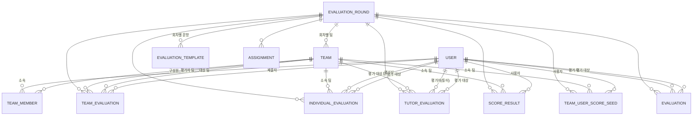

# ERD 명세서

## 기본 정보

| 항목 | 내용 |
|---|---|
| 문서 버전 | 1.0 |
| 기준 | `project/apps/*/models.py` (Django ORM) |
| DB | PostgreSQL |
| PK 규칙 | 모든 테이블 `id` (BigAutoField, `DEFAULT_AUTO_FIELD` 기준) |

## 1. 목적

시스템에서 사용하는 엔티티와 엔티티 간 관계를 정의하여, 데이터 설계와 실제 구현(Django 모델)이
일치하는지 확인하기 위한 문서이다. 상세 컬럼 정의는 [04_table_definition_template.md](./04_table_definition_template.md)를 참고한다.

## 2. 엔티티 목록

| 엔티티 | 소속 앱 | 설명 |
|---|---|---|
| USER | accounts | 로그인 계정. 학생/관리자 겸용, 승인 상태 포함 |
| EVALUATION_ROUND | evaluations | 평가 회차. 가중치·결과 공개 설정 포함 |
| TEAM | teams | 평가 회차별 팀. 평가 진행 상태(`eval_status`) 포함 |
| TEAM_MEMBER | teams | 팀-사용자 소속 관계 (N:M 연결 테이블) |
| TEAM_USER_SCORE_SEED | teams | 사용자별 회차별 누적 시드 점수 |
| EVALUATION_TEMPLATE | evaluations | 평가 회차별 문항 세트 (JSON) |
| EVALUATION | evaluations | 사용자 간 단건 평가(레거시/단순 평가 모델) |
| TEAM_EVALUATION | evaluations | 학생의 팀 평가 |
| INDIVIDUAL_EVALUATION | evaluations | 학생의 개인 평가 |
| TUTOR_EVALUATION | evaluations | 튜터(관리자/스태프)의 팀·개인 평가 |
| SCORE_RESULT | evaluations | 회차별 최종 점수/석차 결과 |
| ASSIGNMENT | evaluations | 회차별 과제 정보 |

> `apps/scoring`, `apps/results`는 현재 별도 모델이 없다. 점수 계산·결과 조회는
> `apps/evaluations`의 `ScoreResult` 등을 참조하는 뷰/서비스 로직으로 처리한다.

## 3. ERD 다이어그램

## 4. 관계 설명

| 관계 | 종류 | 설명 |
|---|---|---|
| USER - TEAM_MEMBER - TEAM | N:M | `TEAM_MEMBER`가 연결 테이블. `(team, student)` 조합은 유일 (`uq_team_student_once`) |
| EVALUATION_ROUND - TEAM | 1:N | 회차가 없어지면 소속 팀도 함께 삭제(`CASCADE`) |
| EVALUATION_ROUND - EVALUATION_TEMPLATE | 1:N | 회차별로 TEAM/INDIVIDUAL/TUTOR 문항 세트를 각각 둘 수 있음 |
| TEAM - TEAM_EVALUATION (평가자/대상) | 1:N (역할 2개) | 같은 `Team`을 `evaluator_team`, `target_team` 두 역할로 참조 |
| USER - INDIVIDUAL_EVALUATION (평가자/대상) | 1:N (역할 2개) | 같은 `User`를 `evaluator`, `target` 두 역할로 참조. `(round, evaluator, target)` 유일 (`uq_individual_evaluation_once`) |
| USER/TEAM - TUTOR_EVALUATION | 1:N (선택적) | `user`, `team` 모두 nullable. 개인 평가는 `user`만, 팀 평가는 `team`만 채움 |
| EVALUATION_ROUND/USER/TEAM - SCORE_RESULT | 1:N | 회차·사용자·소속팀 조합으로 최종 점수/석차 저장 |
| USER/EVALUATION_ROUND - TEAM_USER_SCORE_SEED | 1:N | `(user, round)` 조합은 유일 (`uq_user_round_seed_once`) |

## 5. 참고

- 상세 컬럼/제약조건: [04_table_definition_template.md](./04_table_definition_template.md)
- 코드값/공통 규칙: [05_data_dictionary_template.md](./05_data_dictionary_template.md)
- 비즈니스 배경(점수 계산식 등): [../../ERD.md](../../ERD.md) (참고용, 본 문서에서 수정하지 않음)
