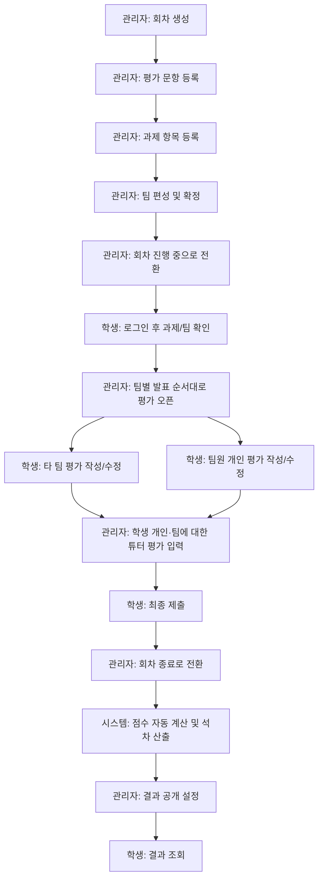

# 전체 시나리오

## 기본 정보

| 항목 | 내용 |
|---|---|
| 목적 | 평가 회차 하나가 준비부터 결과 공개까지 어떻게 흘러가는지 전체 흐름을 정의한다 |
| 등장 역할 | 학생(STUDENT), 관리자/튜터(ADMIN, `is_staff`) |
| 연결 문서 | [03_programs/06_program_list_template.md](../03_programs/06_program_list_template.md) (프로그램 ID), [11_program_scenario_template.md](./11_program_scenario_template.md), [13_workflow_diagram_template.md](./13_workflow_diagram_template.md) |

## 1. 전체 흐름 요약

## 2. 단계별 시나리오

| # | 단계 | 주체 | 내용 | 관련 프로그램 |
|---|---|---|---|---|
| 1 | 회차 생성 | 관리자 | 평가 회차 이름, 기간, 학생/튜터 평가 비중을 설정해 회차를 만든다(상태: `draft`) | P-10 |
| 2 | 평가 문항 등록 | 관리자 | 팀 평가/개인 평가/튜터 평가용 문항 세트를 각각 등록한다 | P-14 |
| 3 | 과제 항목 등록 | 관리자 | 이번 회차에서 평가할 과제의 제목/설명/평가 기간을 등록한다 | P-20 |
| 4 | 팀 편성 | 관리자 | 자동(누적 시드 기반 또는 무작위) 또는 수동으로 팀을 구성하고 확정한다(상태: `ready`) | P-11 / P-11a |
| 5 | 회차 진행 전환 | 관리자 | 회차 상태를 `in_progress`로 전환해 학생 참여를 시작한다 | P-10 |
| 6 | 로그인 및 확인 | 학생 | (최초 1회는 회원가입 → 관리자 승인 필요) 로그인 후 과제 내용과 소속 팀/팀원을 확인한다 | P-02, P-03, P-05, P-06, P-07, P-20 |
| 7 | 팀 발표 순서대로 평가 오픈 | 관리자 | 발표(평가) 순서에 따라 팀을 하나씩 연다. 한 번 열린 팀은 다른 팀이 열려도 계속 열려 있다(누적 오픈) | P-11 |
| 8 | 타 팀 평가 | 학생 | 오픈된 다른 팀을 평가하고, 최종 제출 전까지 몇 번이든 다시 수정한다(자기 팀은 평가 대상에서 제외) | P-17 |
| 9 | 팀원 개인 평가 | 학생 | 같은 팀 동료를 평가한다(본인은 제외), 최종 제출 전까지 수정 가능 | P-18 |
| 10 | 튜터 평가 | 관리자 | 학생 개인 및 팀에 대해 튜터 관점의 평가를 입력한다 | P-21 |
| 11 | 최종 제출 | 학생 | 그 시점까지 임시저장해 둔 팀 평가·개인 평가 전체를 한 번에 확정한다. 모든 평가를 완료하지 않아도 제출할 수 있다(부분 제출 허용). 이후 수정 불가 | P-19 (BR-11) |
| 12 | 회차 종료 | 관리자 | 회차 상태를 `finished`로 전환한다 | P-10 |
| 13 | 점수 계산 | 시스템 | 학생 평가 + 튜터 평가를 가중치대로 합산해 팀/개인/최종 점수(1~5점 스케일)를 계산하고, 최종 점수 내림차순(동점자는 같은 석차, 다음 석차는 동점자 수만큼 건너뜀)으로 석차를 매긴다. 다음 회차 자동 편성에 쓸 누적 시드도 갱신한다 | P-22 (BR-06/07/08) |
| 14 | 결과 공개 설정 | 관리자 | 팀 1위 공개, 전체 팀 순위 공개, 개인 점수 공개, 개인 석차 공개 여부를 각각 켜고 끈다 | P-15 |
| 15 | 결과 조회 | 학생 | 공개 설정된 항목만 본인의 점수/석차로 확인한다 | P-08 |

## 3. 역할별 요약 시나리오

### 학생

1. 회원가입 → 관리자 승인 대기
2. 로그인(이메일 또는 구글)
3. 홈에서 회차 진행 상태 확인
4. 과제 내용 확인
5. 소속 팀과 팀원 확인
6. (회차 진행 중) 발표가 열린 다른 팀 평가 — 여러 번 수정 가능
7. 팀원 개인 평가(본인 제외) — 여러 번 수정 가능
8. 최종 제출 — 모든 평가를 완료하지 않아도 그 시점까지 저장된 내용으로 제출 가능(부분 제출 허용), 이후 수정 불가
9. 결과 공개 후 본인 점수/석차 확인(공개된 항목만)

### 관리자(튜터)

1. 회원가입 승인 및 역할(학생/관리자) 부여
2. 평가 회차 생성 및 문항 등록
3. 과제 항목 등록
4. 팀 편성(자동/수동) 및 확정
5. 회차 진행 상태로 전환
6. 팀별 발표 순서에 따라 평가 오픈
7. 학생 개인·팀에 대한 튜터 평가 입력
8. 평가 현황(제출률/미제출자) 모니터링
9. 회차 종료 처리 → 점수 계산
10. 결과 공개 범위 설정
