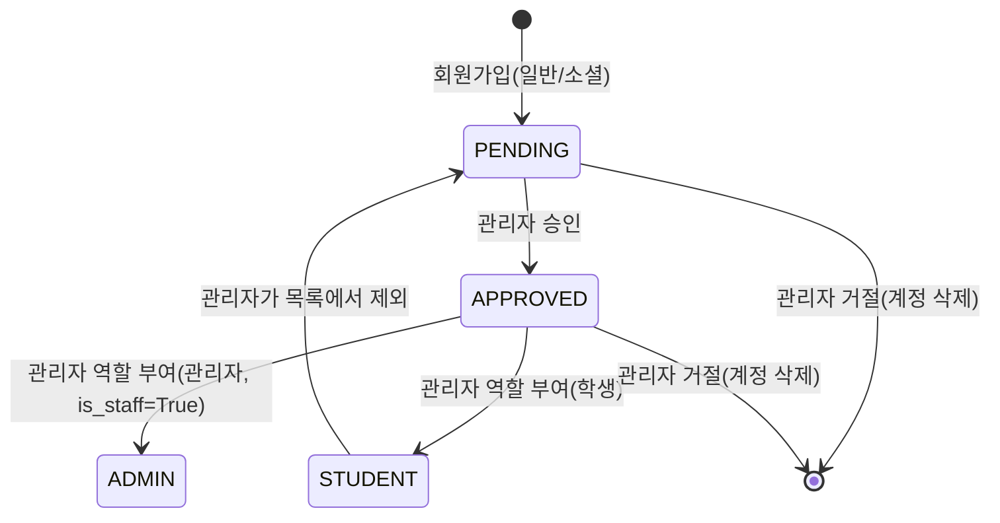
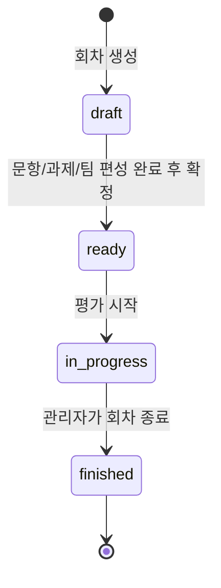
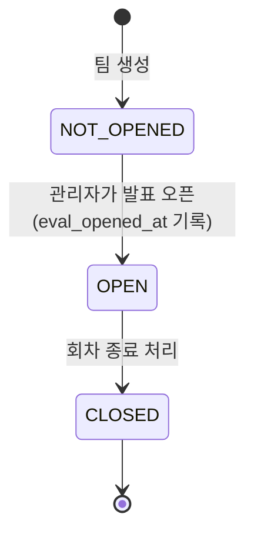
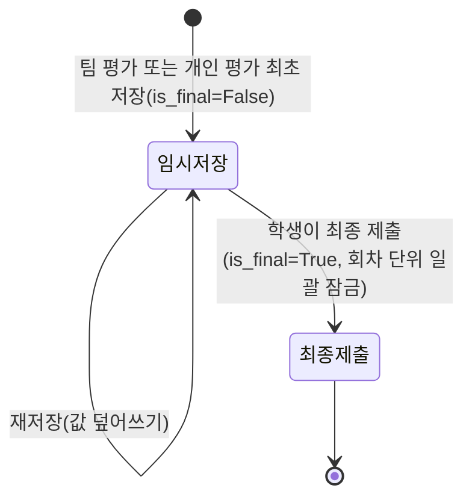
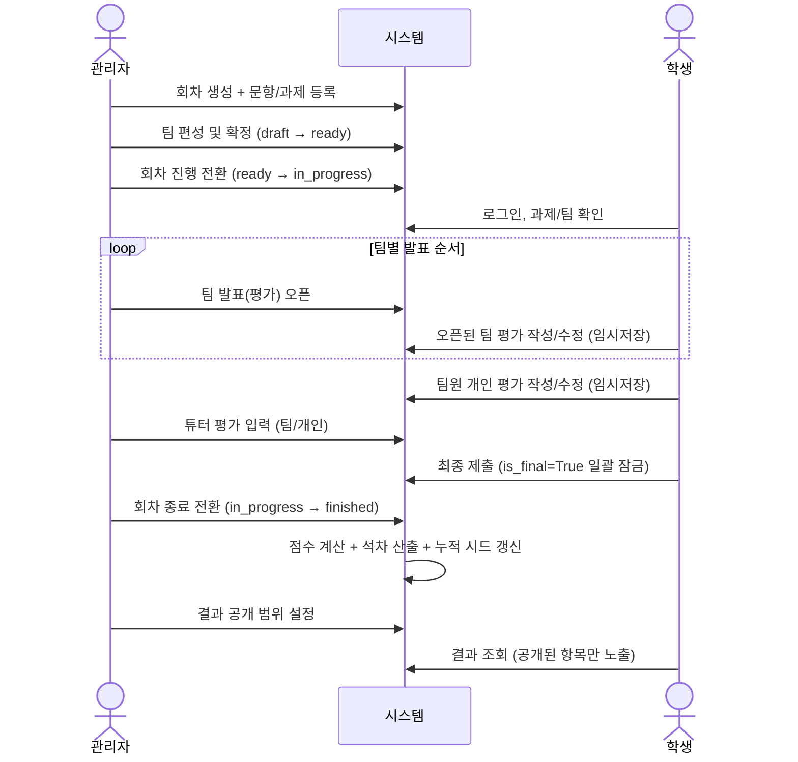

# 워크플로우 다이어그램

## 기본 정보

| 항목 | 내용 |
|---|---|
| 목적 | 주요 엔티티의 상태 전이와 회차 전체 처리 흐름을 다이어그램으로 정리한다 |
| 연결 문서 | [10_overall_scenario_template.md](./10_overall_scenario_template.md), [02_data/05_data_dictionary_template.md](../02_data/05_data_dictionary_template.md)(코드값 정의) |

---

## 1. 계정(USER) 상태 전이

`PENDING`, `APPROVED` 상태에서는 일반 로그인/소셜 로그인 모두 차단된다. `STUDENT`/`ADMIN`으로
역할이 부여된 시점부터 로그인이 가능하다.

---

## 2. 평가 회차(EVALUATION_ROUND) 상태 전이

| 상태 | 의미 | 팀 편성 변경 가능 |
|---|---|---|
| `draft` | 작성 중 | 가능 |
| `ready` | 팀 편성 확정, 시작 대기 | 가능 |
| `in_progress` | 평가 진행 중 | 불가 |
| `finished` | 종료, 점수 계산 완료 | 불가 |

---

## 3. 팀 평가 진행(TEAM.eval_status) 상태 전이

발표(평가) 오픈은 팀별로 누적된다 — 나중에 열린 팀이 있어도 먼저 열린 팀은 계속 `OPEN` 상태를 유지한다.

---

## 4. 학생 평가 제출(is_final) 상태 전이

팀별/문항별 개별 잠금은 없다 — 회차 안에서 학생이 임시저장한 팀 평가·개인 평가 전체가
"최종 제출" 한 번으로 동시에 잠긴다.

---

## 5. 회차 전체 처리 흐름 (관리자 ↔ 학생 ↔ 시스템)

---

## 6. 참고

- 상태값의 상세 정의는 [02_data/05_data_dictionary_template.md](../02_data/05_data_dictionary_template.md)의 "1. 코드값" 참고
- 각 단계의 예외 처리는 [12_detailed_scenario_template.md](./12_detailed_scenario_template.md) 참고
